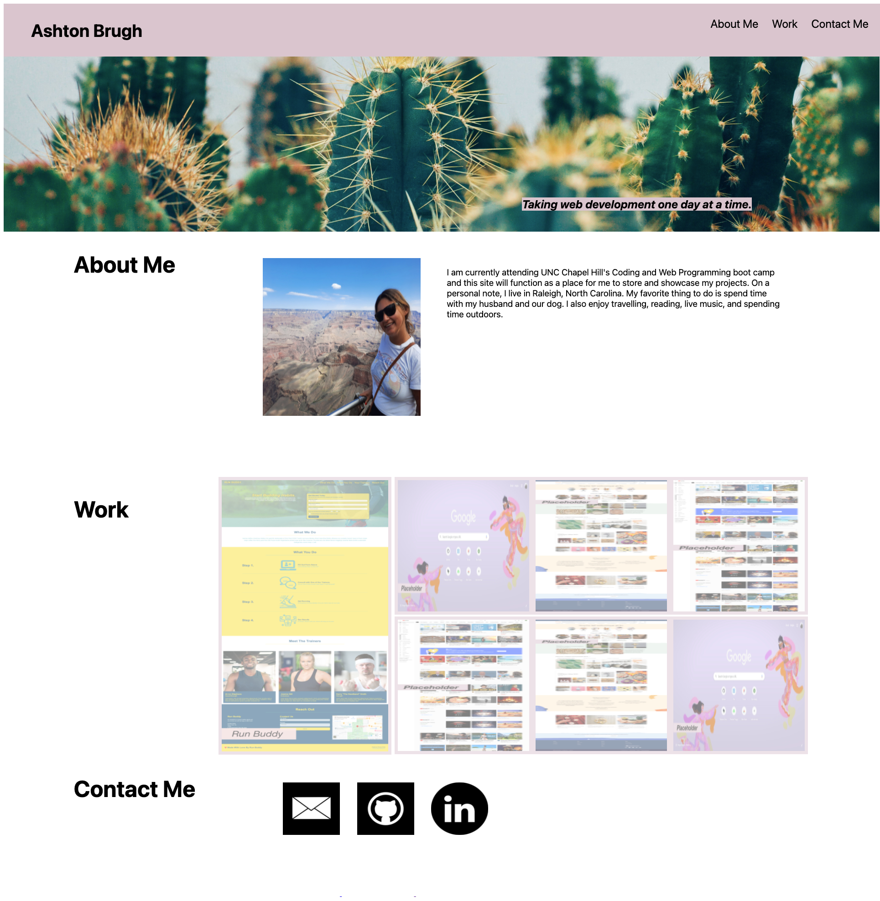

# Portfolio

## Purpose
A website to showcase my projects from UNC Chapel Hill's web programming and coding boot camp. 

## Built With
•HTML
•CSS

## Description
This website was built using HTML and CSS to achieve a working portfolio. In order to do this my first step was to initialize a git repository. I then created the header and the navigation elements. The next step was to add a hero that I thought would add a personal touch to the page. After that, I created flex boxes for the "About Me", "Work", and "Contact Me" section in order to get these section titles to appear on the left side of the page. After writing the "About Me" section and including an image of myself with an alt attribute I styled the work section so the first image would be larger than the other ones. I then made these images h refs so they would link to the appropriate websites. In adding a grid attribute to the work ID and making the smaller images their own flex container they now appear in two rows sitting next to the larger image. For the "Contact Me" section I linked the images to my email, github profile, and linkedin profile. The final step was to add a media query so the page would be cohesive on a smaller screen than my own. 

## Screenshot

